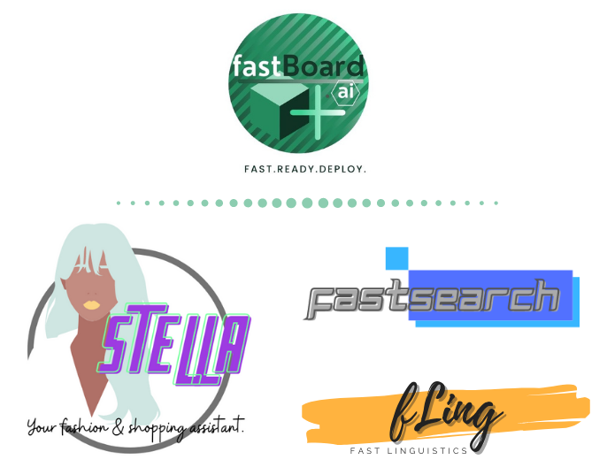

### fastBoard.ai@github
We are fastboard.ai, an independent research and development, organization developing tools and toolkits, for fun, and for use in different domains. We are based all over the world, and our focus is developing toolkits and platforms to enable and promote small businesses. We're interested and building stuff in these topics: gaming, personalization, search, advertising optimization, consumer modeling and targeted ad delivery, etc. Here are a few projects we are dealing with currently.

All the following projects are ongoing.
- [fling](https://github.com/fastboardAI/fling) : Linguistic feature extraction for domain specific tasks. 💡 
- [stella](https://github.com/fastboardAI/stella) : Your personal AI fashionista.👩 
- [fastSearch](https://github.com/fastboardAI/fastSearch) : AI based search framework for ecommerce and travel applications. 🔍

feel free to send mail to fastboardai@gmail.com for collaborations and to find out what we can do for you.
