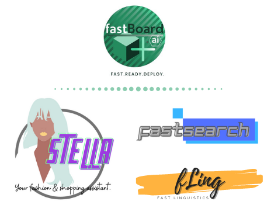

### fastBoard.ai@github
We are fastboard.ai, an independent research organization developing tools and toolkits, for fun and for use in different domains. We are based all over the world, and our focus is developing end to end toolkits and platforms to enabling and promoting small business. Domains we work on are: personalization, search, advertising optimization, consumer modeling and targeted ad delivery, etc. Here are a few projects we are dealing with currently.

- [fling](https://github.com/fastboardAI/fling) : Linguistic feature extraction for domain specific tasks. 💡 
- [stella](https://github.com/fastboardAI/stella) : Your personal AI fashionista.👩 
- [fastSearch](https://github.com/fastboardAI/fastSearch) : AI based search framework for ecommerce and travel applications. 🔍
